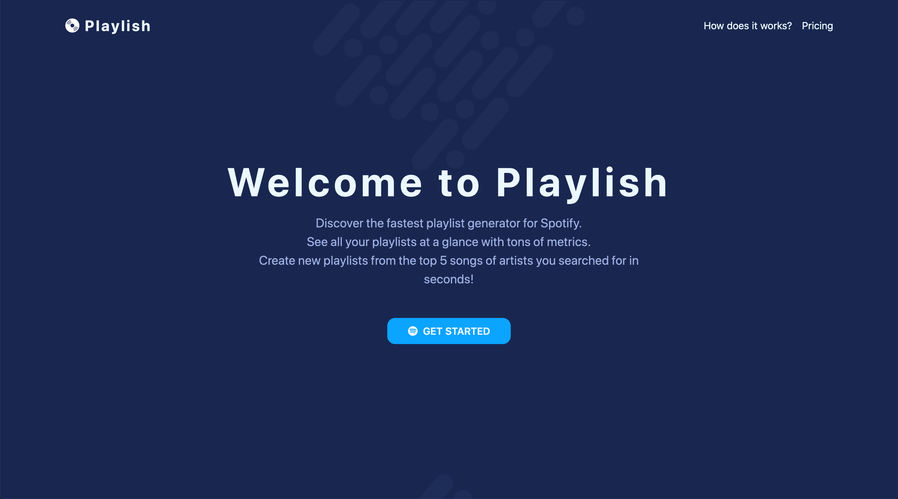
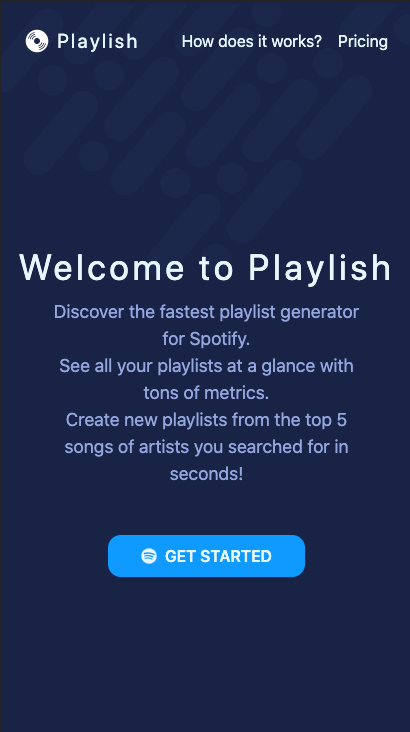

<h1 align="center">🎹 Playlish</h1>

<p align="center">
  <a href="https://github.com/prettier/prettier"></a>
  <a href="https://circleci.com/gh/litil/playlish/tree/master"></a>
  <a href="https://app.netlify.com/sites/playlish/deploys"></a>
  <a href="https://github.com/litil/playlish"></a>
  <a href="mailto:guillaume.p.lambert@gmail.com"></a>
  <a href="https://twitter.com/shipasap"></a>
</p>

<p align="center">
  ⚡️ <i>Discover the fastest playlist generator for Spotify</i> ⚡️
  <br>
  <a href="https://playlish.io"><b>https://playlish.io</b></a>
</p>

<p align="middle" style="margin-bottom:40px; margin-top:32px; width:100%;">
  
  
</p>

## 🤷‍♂️ Where does the idea come from?

I am huge fan of music festivals. I attend at least 2 festivals a year, up to 5, mostly all during summer. I think what I love the most is listening to the entire lineup to discover new songs so that I can boast to my friends to know this faaaaaaamous group (let's be honest :) ).

What I was doing for the past few years was searching for every artists on Spotify I've never heard of, then adding their 3 to 5 most famous songs (_also known as top tracks in Spotify_) to a common playlist. Then, I was able to listened to those curated playlists before each festivals.

I was tired of having to do it for each festivals, so I created a quick React app which creates a playlist with the first 5 top tracks of each artists I looked for.

There's place for tons of improvements but that's still a huge time saver for me 💪

## 📚 How to contribute?

I haven't written any _How to contribute_ guidelines but if you're interested in improving this project, just shout me a message! As I said above, there's room for improvements and I already thought about really cool features:

- automatically create playlists from festival lineup
- more metrics such as number of hours a playlists have been played
- more music providers: Deezer, Tidal ...

## 👨‍💻 Stack

This project was bootstrapped with [Create React App](https://github.com/facebook/create-react-app). No custom API needed, this app only relies on music providers APIs.

The continuous integration job is done by [Create React App](https://circleci.com/gh/litil/playlish/tree/master).

The site is hosted on [Netlify](https://app.netlify.com/sites/playlish/deploys). No specific configuration required.

## ⌨️ Scripts

As the app has been created with create-react-app, you'll find the same scripts as for other CRA apps.

### Install and start

To run Playlish, simply clone the repository and then run:

```
yarn install
yarn start
```

If you prefer use npm run:

```
npm install
npm start
```

This will run the app in the development mode.<br>
Then open [http://localhost:3000](http://localhost:3000) to view it in the browser.

### Run the tests

To run the test, simply run:

```
yarn test
```

If you prefer use npm run:

```
npm test
```

### Build the application

To build the app for production, simply run:

```
yarn build
```

If you prefer use npm run:

```
npm run build
```

This will bundles the React applicaiton in production mode and optimize the build for the best performance.
The build is minified and the filenames include the hashes.<br>
